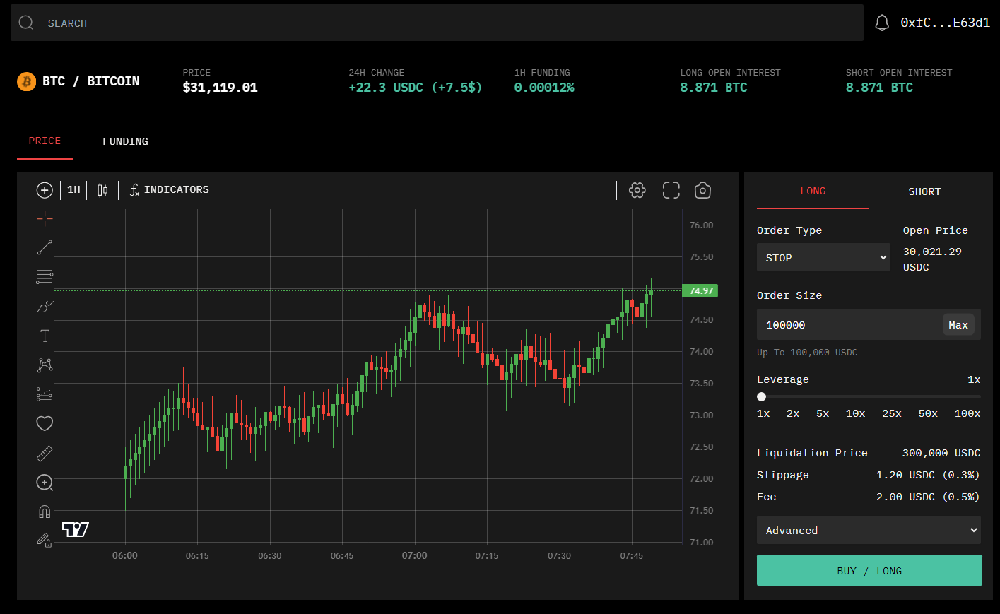

# Trading Platform UI

This is a UI for a trading platform built using Javascript, React.js, and Tailwind CSS. Below is a picture preview of the platform, which includes interactable elements, such as order type, order size, and leverage sliders. The chart is built using TradingView's lightweight-charts [API](https://github.com/tradingview/lightweight-charts) and is currently populated with fake data. 



## Running Locally

To run this website locally, you just need to:

```npm install```

and

```npm start```

In the future, I may hook the chart up to a price stream using an API, but that would most likely require personal keys, a dot env file, and would not be shared with others, so I thought the exercise pointless for now.


